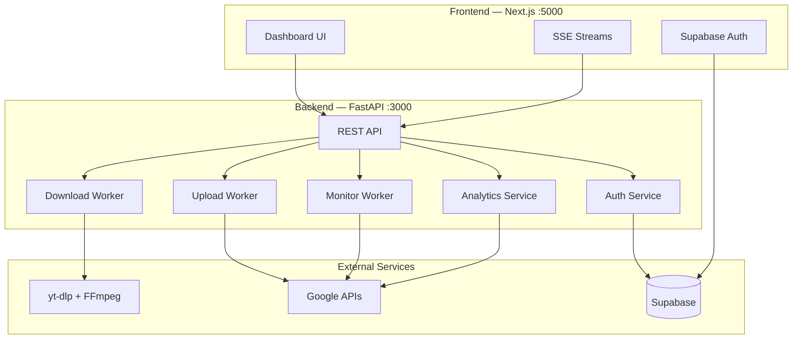

<div align="center">

# ⚡ Nothing

### Multi-Platform Video Downloader & YouTube Automation Suite

*Download from 17 platforms. Upload to YouTube. Monitor channels. Analyze performance. All from one dashboard.*

<br/>

[](LICENSE)
[](https://python.org)
[](https://fastapi.tiangolo.com)
[](https://nextjs.org)
[](https://github.com/Unknowmyt1M/Nothing/stargazers)

</div>

---

## Overview

**Nothing** is a self-hosted media automation platform that combines video downloading, YouTube channel management, and analytics into a single futuristic dashboard. Built for creators who want full control over their content pipeline.

```
 Download        Process         Upload         Monitor         Analyze
    │               │               │               │               │
    ▼               ▼               ▼               ▼               ▼
┌────────┐    ┌──────────┐    ┌──────────┐    ┌──────────┐    ┌──────────┐
│  URL   │───▶│ Metadata │───▶│ YouTube  │───▶│ Channel  │───▶│ Dashboard│
│  Input │    │ Extract  │    │ Uploader │    │ Monitor  │    │  & CSV   │
└────────┘    └──────────┘    └──────────┘    └──────────┘    └──────────┘
```

---

## Features

<table>
<tr>
<td width="50%">

### Download Engine
- **17 platforms** — YouTube, Instagram, Facebook, X/Twitter, TikTok, Vimeo, Reddit, Twitch, Rumble, and more
- **Quality selection** — 144p to 4K with audio merge
- **Smart metadata** — Auto-extract titles, descriptions, hashtags
- **Cancellation** — Cancel mid-download with cleanup
- **Size safety** — 4GB file size limit with warnings
- **Error recovery** — 23 classified error codes with smart retry

</td>
<td width="50%">

### YouTube Automation
- **Channel monitoring** — RSS feed polling with configurable intervals
- **Auto-upload** — Push new videos to your YouTube channel automatically
- **Metadata sync** — Titles, descriptions, tags transfer automatically
- **Analytics dashboard** — Views, subscribers, revenue, traffic sources
- **Export** — CSV and JSON export of all analytics data
- **Health scoring** — Channel health score with actionable insights

</td>
</tr>
</table>

---

## Tech Stack

<div align="center">

| Layer | Technology | Purpose |
|:------|:-----------|:--------|
| **Frontend** |    | Dashboard UI, SSE streaming |
| **Backend** |   | REST API, background workers |
| **Download** |   | Video extraction, audio merge |
| **Database** |   | User data, settings, logs |
| **Auth** |   | YouTube API token management |

</div>

---

## Quick Start

### Prerequisites

- **Python 3.13+** & **Node.js 18+**
- **FFmpeg** (on PATH or auto-discovered)
- **Google Cloud** project with YouTube Data API v3 enabled

### 1. Clone & Configure

```bash
git clone https://github.com/Unknowmyt1M/Nothing.git
cd Nothing

# Copy environment template
cp .env.example .env

# Edit with your credentials
```

### 2. Start

```bash
python main.py
```

This automatically starts both servers:

| Service | URL | Description |
|:--------|:----|:------------|
| **Frontend** | `http://localhost:5000` | Dashboard UI |
| **Backend API** | `http://localhost:3000` | REST API |
| **API Docs** | `http://localhost:3000/docs` | OpenAPI/Swagger |

### 3. Connect Google

Navigate to **Integrations** → click **Sync Google Account** → sign in with Google.

---

## Supported Platforms

| Platform | Download | Upload | Auto-Monitor |
|:---------|:--------:|:------:|:------------:|
| YouTube | `✅` | `✅` | `✅` |
| Instagram | `✅` | `—` | `✅` |
| Facebook | `✅` | `—` | `✅` |
| X / Twitter | `✅` | `—` | `✅` |
| TikTok | `✅` | `—` | `✅` |
| Vimeo | `✅` | `—` | `—` |
| Reddit | `✅` | `—` | `✅` |
| Twitch | `✅` | `—` | `✅` |
| Rumble | `✅` | `—` | `✅` |
| Direct URL | `✅` | `—` | `—` |

---

## Architecture



---

## Project Structure

```
Nothing/
├── backend/
│   ├── api/                    # FastAPI route handlers
│   │   ├── analytics_routes.py # YouTube Analytics API endpoints
│   │   ├── auth_routes.py      # OAuth + Supabase auth flows
│   │   ├── automation_routes.py # Channel monitor + auto-upload
│   │   └── downloader_routes.py # Download + extraction API
│   ├── database/
│   │   ├── json_db.py          # Local JSON file storage
│   │   └── supabase_client.py  # Supabase REST API client
│   ├── platforms/              # Platform-specific extractors
│   │   ├── youtube.py          # YouTube URL validation
│   │   ├── instagram.py        # Instagram extraction
│   │   └── base.py             # yt-dlp wrapper
│   ├── services/
│   │   ├── automation_service.py   # Background monitor worker
│   │   ├── downloader_service.py   # Download orchestration
│   │   ├── uploader_service.py     # YouTube upload pipeline
│   │   └── youtube_analytics.py    # Analytics API v2 client
│   ├── errors.py               # 23 classified error codes
│   ├── config.py               # Environment configuration
│   └── app.py                  # FastAPI app factory
├── frontend/
│   └── src/
│       ├── app/                # Next.js App Router pages
│       │   ├── analytics/      # YouTube Analytics dashboard
│       │   ├── automation/     # Channel monitor UI
│       │   ├── metadata/       # Diagnostics hub
│       │   └── platforms/      # Platform reference
│       ├── components/
│       │   ├── analytics/      # 13 analytics components
│       │   ├── automation/     # Monitor + feed management
│       │   ├── downloader/     # URL input, extraction, errors
│       │   └── accounts/       # Google OAuth + settings
│       └── lib/
│           └── supabaseClient.js
├── cookies/                    # Platform auth cookies
├── downloads/                  # Output directory
└── main.py                     # Unified entry point
```

---

## Configuration

All configuration is via environment variables. Copy `.env.example` to `.env`:

<details>
<summary><strong>Environment Variables Reference</strong></summary>

```env
# ── Server ──────────────────────────
PORT=3000
HOST=0.0.0.0
DEBUG=False
FRONTEND_URL=http://localhost:5000

# ── Security ────────────────────────
SESSION_SECRET=<random-64-char-hex>

# ── Google OAuth ────────────────────
GOOGLE_CLIENT_ID=<your-client-id>
GOOGLE_CLIENT_SECRET=<your-client-secret>
GOOGLE_REDIRECT_URI=http://localhost:3000/api/auth/callback

# ── Supabase ────────────────────────
SUPABASE_URL=https://<project-ref>.supabase.co
SUPABASE_ANON_KEY=<anon-key>
SUPABASE_SERVICE_ROLE_KEY=<service-role-key>

# ── Frontend (NEXT_PUBLIC_*) ────────
NEXT_PUBLIC_SUPABASE_URL=https://<project-ref>.supabase.co
NEXT_PUBLIC_SUPABASE_ANON_KEY=<anon-key>

# ── Safety ──────────────────────────
MAX_FILE_SIZE_MB=4096
```

</details>

---

## API Endpoints

<details>
<summary><strong>Core API Routes</strong></summary>

| Method | Endpoint | Description |
|:-------|:---------|:------------|
| `POST` | `/api/extract` | Extract video metadata from URL |
| `POST` | `/api/download` | Start a download job |
| `GET` | `/api/download/{id}/progress` | SSE progress stream |
| `POST` | `/api/download/{id}/cancel` | Cancel active download |
| `GET` | `/api/platforms` | List supported platforms |

</details>

<details>
<summary><strong>Auth & Account Routes</strong></summary>

| Method | Endpoint | Description |
|:-------|:---------|:------------|
| `GET` | `/api/auth/status` | Check authentication state |
| `POST` | `/api/auth/supabase_callback` | Supabase OAuth callback |
| `POST` | `/api/auth/supabase_sync` | Sync Supabase session |
| `GET` | `/api/auth/logout` | Clear session |

</details>

<details>
<summary><strong>Automation & Analytics Routes</strong></summary>

| Method | Endpoint | Description |
|:-------|:---------|:------------|
| `GET` | `/api/automation/get_settings` | Get automation config |
| `POST` | `/api/automation/save_settings` | Save API key + interval |
| `GET` | `/api/automation/get_channels` | List monitored channels |
| `POST` | `/api/automation/add_channel` | Add channel to monitor |
| `GET` | `/api/automation/status` | Worker status + logs |
| `POST` | `/api/automation/start` | Start monitor worker |
| `POST` | `/api/automation/stop` | Stop monitor worker |
| `GET` | `/api/analytics/overview` | YouTube channel overview |
| `GET` | `/api/analytics/videos` | Top performing videos |
| `GET` | `/api/analytics/traffic` | Traffic source breakdown |
| `GET` | `/api/analytics/audience` | Audience demographics |
| `GET` | `/api/analytics/export` | Export data as CSV/JSON |

</details>

---

## Error Handling

The system classifies all errors into **23 structured codes** for clear user feedback:

| Code | Error | Description |
|:-----|:------|:------------|
| `NETWORK_TIMEOUT` | Connection timed out | Slow or no internet |
| `VIDEO_UNAVAILABLE` | Video is private/removed | Content not accessible |
| `GEO_RESTRICTED` | Geo-blocked content | Region restriction |
| `RATE_LIMITED` | Too many requests | Platform throttle |
| `LOGIN_REQUIRED` | Authentication needed | Private content |
| `BOT_CHECK` | Bot detection triggered | Anti-scraping block |
| `YOUTUBE_AUTH_EXPIRED` | Token expired | Re-auth required |
| `UNSUPPORTED_URL_TYPE` | Unknown URL format | Platform not supported |

> Full error reference in `backend/errors.py`

---

## Contributing

Contributions are welcome. The project follows standard fork-branch-PR workflow:

```bash
# Fork the repo, then:
git checkout -b feature/my-feature
git commit -m "feat: add new platform extractor"
git push origin feature/my-feature
# Open a Pull Request
```

**Guidelines:**
- Python code follows PEP 8
- Frontend uses functional components with hooks
- Add tests for new platform extractors
- Update `supported platforms` table in README

---

## License

This project is licensed under the **MIT License** — see [LICENSE](LICENSE) for details.

---

<div align="center">

**Built with Python, FastAPI, Next.js, yt-dlp, and Supabase**

*Full control over your content pipeline.*

</div>
